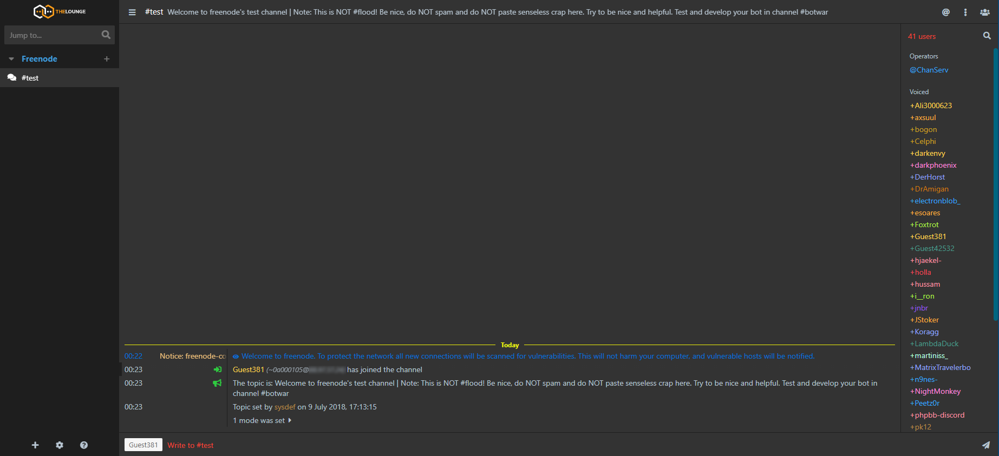

<h1 align="center">
	OcUK Dark theme for The Lounge Chat
</h1>

<h3 align="center">
	An elegant theme with dark colours
</h3>

<p align="center">
	<strong>
		<a href="https://thelounge.chat/">Website</a>
		•
		<a href="https://thelounge.chat/docs">Docs</a>
		•
		<a href="https://demo.thelounge.chat/">Demo</a>
	</strong>
</p>

<p align="center">
	<a href="https://demo.thelounge.chat/"></a>
	<a href="https://yarn.pm/thelounge"></a>
	<a href="https://github.com/thelounge/thelounge/actions"></a>
	<a href="https://npm-stat.com/charts.html?package=thelounge&from=2016-02-12"></a>
</p>

<p align="center">
	
</p>


## Installation :sparkles:
Install this theme with:

```sh
thelounge install thelounge-theme-ocuk-dark
```

## Issues :sparkles:  
If you have an issue, change request or comment about this theme please report it below:<br/>
<a href="https://github.com/el-profesor926/thelounge-theme-ocuk-dark/issues">/thelounge-theme-ocuk-dark/issues</a>
